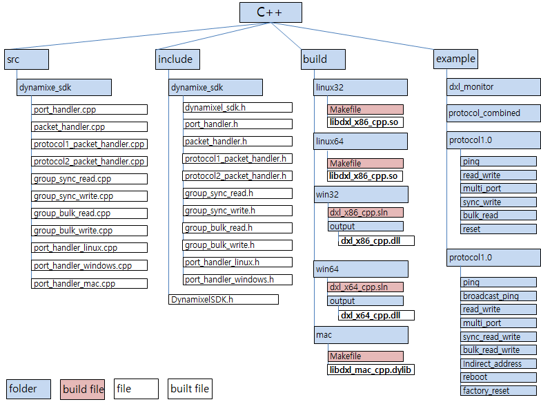
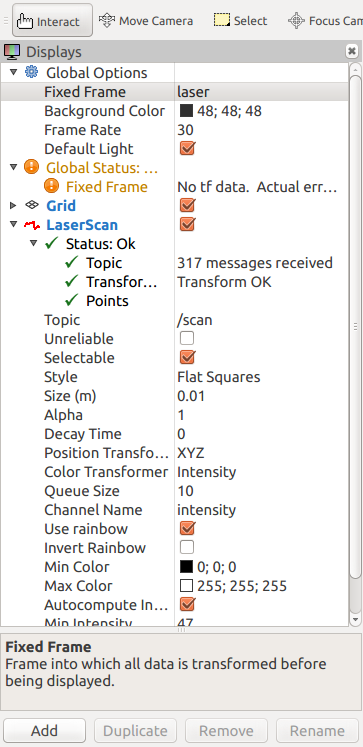
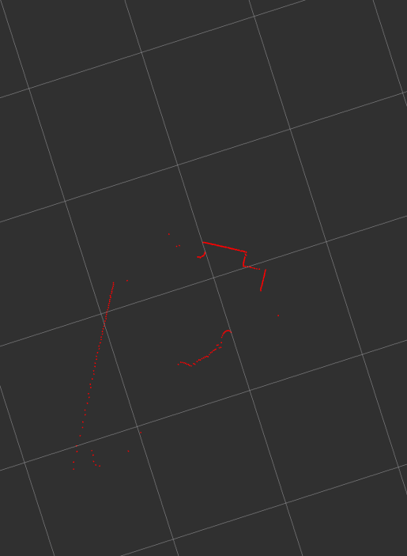

### Dynamixel
Keywords: Dynamixel SDK C/C++ API, Dynamixel Protocol 2.0, USB2Dynamixel, U2D2, Protocol 2.0, Control Table, EEPROM Area, RAM Area
On linux, Dynamixel SDK is available as shared library (.so) as well as source code. Examples are also available

#### Overview

ROBOTIS Dynamixel SDK is a software development kit that provides Dynamixel control functions using packet communication. The Dynamixel API requires programming in C/C++. We wull use the recommended Protocol 2.0 for communicating with the X-series servo. We will test the SDK on Ubuntu 16.04 LTS running on Intel X86 and Raspbian running on Raspberry Pi 3. We will use FT232RL serial board from Sparkfun with custom circuit to perform half-duplex communication with the servo. Finally we will also test the dynamixel using ROS C++ package on Ubunutu or Raspbian. 


##### Installation

We cloned the dynamixel repository on github: https://github.com/ROBOTIS-GIT/DynamixelSDK
```
> git clone https://github.com/ROBOTIS-GIT/DynamixelSDK.git
```
We also installed the ROS library
```
>sudo apt-get install ros-kinetic-dynamixel-sdk      # we are using ROS-Kinetic
```
Before we start exploring the library, we will install hardware driver for FT232L


FDTI devices have two types of driver - virual COM port driver (VCP) and D2XX API driver. FTDI VCP driver is build into the Linux kernel. In Linux, VCP drivers will appear as /dev/ttyUSBx.

Verify built-in COM port
1. Plug in FTDI device
2. In terminal window
```
> dmesg | grep FTDI
# The following output should be generated
[334680.372193] usb 2-1.2.2: Manufacturer: FTDI
[334681.410183] usbserial: USB Serial support registered for FTDI USB Serial Device
[334681.410249] ftdi_sio 2-1.2.2:1.0: FTDI USB Serial Device converter detected
[334681.410899] usb 2-1.2.2: FTDI USB Serial Device converter now attached to ttyUSB0
[334683.068937] ftdi_sio ttyUSB0: FTDI USB Serial Device converter now disconnected from ttyUSB0
[334693.939291] usb 2-1.2.2: Manufacturer: FTDI
[334693.942056] ftdi_sio 2-1.2.2:1.0: FTDI USB Serial Device converter detected
[334693.942666] usb 2-1.2.2: FTDI USB Serial Device converter now attached to ttyUSB0
[334696.892600] ftdi_sio ttyUSB0: FTDI USB Serial Device converter now disconnected from ttyUSB0
[334718.771810] usb 2-1.2.2: Manufacturer: FTDI
[334718.774809] ftdi_sio 2-1.2.2:1.0: FTDI USB Serial Device converter detected
[334718.775587] usb 2-1.2.2: FTDI USB Serial Device converter now attached to ttyUSB0
[334889.403163] ftdi_sio ttyUSB0: FTDI USB Serial Device converter now disconnected from ttyUSB0
[334903.601907] usb 2-1.2.2: Manufacturer: FTDI
[334903.604827] ftdi_sio 2-1.2.2:1.0: FTDI USB Serial Device converter detected
[334903.605279] usb 2-1.2.2: FTDI USB Serial Device converter now attached to ttyUSB0
[334915.771189] ftdi_sio ttyUSB0: FTDI USB Serial Device converter now disconnected from ttyUSB0
[334925.854973] usb 2-1.2.2: Manufacturer: FTDI
[334925.858182] ftdi_sio 2-1.2.2:1.0: FTDI USB Serial Device converter detected
[334925.858748] usb 2-1.2.2: FTDI USB Serial Device converter now attached to ttyUSB0
```

### Dynamixel SDK 

#### File Structure
Example codes are using either C/C++. Dynamixel SDK repo folder contains folders for each supported API language. We are interested in C++. 

In c++ folder, you'll find cpp source files, header files, build files and example codes. 




Though the PortHandler which handles system communication environment is separated in three OS, the Linux, the macOS and the Windows, the other sources are made to be able to be cross-compiled. We use a separate Makefile for each environment to build the src code. 

There is example code in `example` folder. For us, the subfolder `protocol2.0` containst the relevant example code. There are platform specific Makefiles in example/protocol2.0 to build the example code. 


The dynamixel SDK expect the device name to be `/dev/ttyUSB0` for linux system, we have verified that to be the case. 

Note: The SDK has been tested on Ubuntu 16.04 and Raspbian Jessie, which we are using. 

#### Library Setup
For detailed instruction, see [here](http://emanual.robotis.com/docs/en/software/dynamixel/dynamixel_sdk/library_setup/cpp_linux/#cpp-linux)

1. Compiler: GNU gcc ver. 5.4.0 20160609 or higher
```
> gcc -v
gcc version 5.4.0 20160609 (Ubuntu 5.4.0-6ubuntu1~16.04.10) 
```
2. Builder
```
> sudo apt-get install build-essential
```
3. Dependent Packages: packages needed for cross-compiling
```
> sudo apt-get install gcc-multilib g++-mulitlib
```
4. Build the library: navigate to `linux64` subdirectory in `build`
```
> pwd
/home/rk/repos/DynamixelSDK/c++/build/linux64
```
5. Invoke make: This will generate a shared library file, `libdxl_x64_cpp.so`
6. Install the library: 
```
> sudo make install
```
#### Running the Sample Code
1. Navigate to example code for linux64
```
> pwd   
/home/rk/repos/DynamixelSDK/c++/example/protocol2.0/read_write/linux64
```
2. Invoke make
```
> make
> ls
Makefile  read_write
```
3. Make the port available to be used
> sudo chmod a+rw /dev/ttyUSB0
```
4. Run the executable
```
> ./read_write
```
Succeeded to open the port!
Succeeded to change the baudrate!
Dynamixel has been successfully connected 
```

Robotis also provides code for interactive control through `dxl_monitor`. Navigate to dxl_monitor folder
```
> pwd
/home/rk/repos/DynamixelSDK/c++/example/dxl_monitor
```
Navigate to `linux64` folder, and make
```
> pwd
/home/rk/repos/DynamixelSDK/c++/example/dxl_monitor/linux64
> make
> ./dxl_monitor            # run to go into interactive mode
> ?                        # list command help
```
Use XL430-250T parameters as specified [here](http://emanual.robotis.com/docs/en/dxl/x/xl430-w250/#control-table-description)


### RPiLIDAR

### RPLIDAR SDK
We will detail use of RPLIDAR SDK on Ubuntu 16.04 LTS. 

1. Clone the open source SDK from github repository
```
git clone https://github.com/Slamtec/rplidar_sdk.git
```

### Cleaning up Raspberry Pi
Raspberry Pi has lot of bloatware which takes up space on the SD card. We will show steps to remove unnecessary software installed on Raspberry Pi
```
> sudo apt-get purge wolfram-engine
> sudo apt-get clean; sudo apt-get autoremove
> sudo apt-get purge libreoffice*
> sudo apt-get clean; sudo apt-get autoremove
> 
```


### Running ROS on multiple machines


#### Configuring Raspberry Pi for Internet over Wifi
For our purposes, we would like to remotely configure / control Turtlebot from our PC. The onboard Raspberry Pi is capable of connectivity over Ethernet and Wifi. We would configure its Wifi, so that we can connect to it over our home Wifi network. 
In future, we could use this same home Wifi router to communicate to Turtlebot and view its status over the internet from anywhere in the world. 

Based on the guidelines here, we configured the wireless interface first. We configured it for home network, with a netmask of `255.255.255.0` and gateway of `192.xxx.xxx.xxx`. The ip address was statically assigned. On Raspbian, interface are configured by editing the /etc/network/interfaces file. Our file looked as follows

```
# ethernet config
auto eth0
iface eth0 inet static
    address 192.xxx.xxx.xxx
    netmask 255.255.255.0
    gateway 192.xxx.xxx.xxx

# wifi config
auto wlan0
allow-hotplug wlan0
iface wlan0 inet static
    address 192.xxx.xxx.xxx
    netmask 255.255.255.0
    gateway 192.xxx.xxx.xxx
    wpa-conf /path_to_wpa_supplicant/wpa_supplicant.conf

source-directory /path_to_interfaces.d/interfaces.d
```

Then we configured the wpa_supplicant.conf. This file is read by the wpa_supplicant daemon, to perform wpa_client actions on the host machine. 

```
ctrl_interface=DIR=/var/run/wpa_supplicant GROUP=netdev
update_config=1
country=US

network={
        ssid="My_SSID"
        scan_ssid=1
        psk="pass_phrase"
        key_mgmt=WPA-PSK
}
```
We had to provide the `scan_ssid=1` field, because our SSID is hidden. The result of the fields are standard.

To test the Wifi, the ethernet was disconnected, and Pi was rebooted. On reboot, we did an ssh into Pi from our PC. 
```
> ssh pi@192.xxx.xxx.xxx
pi@192.xxx.xxx.xxx's password:
```
This indicates that we can communicate to Raspberry Pi over the home-WLAN. 

#### Communicating over multiple Machines using ROS
We intend to run some nodes on Raspberry Pi, and computation intensive nodes and ROS master on PC. To verify, that we could do so, we tested communication between talker and listener nodes running on Raspberry PI and PC respectively. 

It is assumed that ROS has already been installed on Raspberry Pi. We followed the ROS tutorial provided [here](http://wiki.ros.org/ROS/Tutorials/MultipleMachines)

1. Start ROS on PC
```
# start ROS master on PC
> roscore
# configure ROS_MASTER_URI
> export ROS_MASTER_URI=http://pc_ip:11311
# run listener
> rosrun rospy_tutorials listener.py
```
2. Start ROS on Raspberry Pi
```
# ssh to Pi
> ssh pi@192.xxx.xxx.
# Configure ROS_MASTER_URI
> export ROS_MASTER_URI=http://pc_ip:11311
#configure ROS_IP
> export ROS_IP=Raspi_wlan_ip
# run talker
> rosrun rospy_tutorials talker.py
```
This should start showing messages sent by talker to listener, on the PC. If successful, we are done. Now we have a distributed ROS system, where master runs on PC, and other ROS nodes run on either PC or Raspberry Pi. 


### ROS Installation Raspberry Pi

[ROS Kinetic Installation on Raspberry Pi Stretch](http://wiki.ros.org/action/fullsearch/ROSberryPi/Installing%20ROS%20Kinetic%20on%20the%20Raspberry%20Pi?action=fullsearch&context=180&value=linkto%3A%22ROSberryPi%2FInstalling+ROS+Kinetic+on+the+Raspberry+Pi%22)


#### Dynamixel Installation on Raspberry Pi
We are interested in installing the following ROS packages for dynamixel - dynmixel_sdk, dynamixel-workbench-toolbox, dynamixel-workbench-controllers, dynamixel-workbench-operators. We will download the catkin packages into a separate workspace and then build packages using catkin. 

We will install the following dependencies before hand - sensor_msgs. In our bare bones installation of ROS on raspberry Pi, we did not install these packages. 

Navigate to ros_catkin_ws. 
```
> cd ~/ros_catkin_ws
> rosinstall_generator sensor_msgs --rosdistro kinetic --deps --wet-only --tar > kinetic-custom_ros.rosinstall
> wstool merge -t src kinetic-custom_ros.rosinstall
> wstool update -t src/
> rosdep install --from-paths src --ignore-src --rosdistro kinetic -y -r --os=debian:stretch
> sudo ./src/catkin/bin/catkin_make_isolated --install -DCMAKE_BUILD_TYPE=Release --install-space /opt/ros/kinetic
> source devel_isolated/setup.bash
> rospack find sensor_msgs
/home/pi/ros_catkin_ws/src/common_msgs/sensor_msgs
```
We created a separate directory dyanmixel_ws
```
> mkdir -p dynamixel_ws/src
> cd dynamixel_ws/src
> git clone https://github.com/ROBOTIS-GIT/dynamixel-workbench.git
> ls 
dynamixel-workbench
```
Lets view the package dependecies
```
> cd dynamixel-workbench
> find -P -name package.xml| while read line; do echo $line; cat $line | grep depend; done
./dynamixel_workbench_single_manager_gui/package.xml
  <buildtool_depend>catkin</buildtool_depend>
  <depend>roscpp</depend>
  <depend>qtbase5-dev</depend>
  <depend>qt5-qmake</depend>
  <depend>dynamixel_workbench_msgs</depend>
  <depend>dynamixel_workbench_toolbox</depend>
  <exec_depend>libqt5-core</exec_depend>
  <exec_depend>libqt5-gui</exec_depend>
./dynamixel_workbench_operators/package.xml
  <buildtool_depend>catkin</buildtool_depend>
  <depend>roscpp</depend>
  <depend>dynamixel_workbench_msgs</depend>
./dynamixel_workbench/package.xml
  <buildtool_depend>catkin</buildtool_depend>
  <exec_depend>dynamixel_workbench_controllers</exec_depend>
  <exec_depend>dynamixel_workbench_operators</exec_depend>
  <exec_depend>dynamixel_workbench_single_manager</exec_depend>
  <exec_depend>dynamixel_workbench_single_manager_gui</exec_depend>
  <exec_depend>dynamixel_workbench_toolbox</exec_depend>
./dynamixel_workbench_controllers/package.xml
  <buildtool_depend>catkin</buildtool_depend>
  <depend>roscpp</depend>
  <depend>sensor_msgs</depend>
  <depend>geometry_msgs</depend>
  <depend>dynamixel_workbench_msgs</depend>
  <depend>dynamixel_workbench_toolbox</depend>
./dynamixel_workbench_toolbox/package.xml
  <buildtool_depend>catkin</buildtool_depend>
  <depend>roscpp</depend>
  <depend>dynamixel_sdk</depend>
./dynamixel_workbench_single_manager/package.xml
  <buildtool_depend>catkin</buildtool_depend>
  <depend>roscpp</depend>
  <depend>dynamixel_workbench_msgs</depend>
  <depend>dynamixel_workbench_toolbox</depend>
```
One can see that `/dynamixel_workbench_single_manager_gui` has additional dependencies. This package is for GUI based dynamixel control, which we don't need. So lets eliminate this package, and bring out the rest of the packages into the source directory
```
> rm -rf dynamixel_workbench dynamixel_workbench_single_manager_gui
> mv dynamixel_workbench* ../
> cd ../
> rm -rf dynamixel_workbench
```
Now let's build
```
> catkin_make
# build complete
> source devel/setup.sh
```

## RPLIDAR Setup
The `rplidar` [package](http://wiki.ros.org/rplidar) provides basic device handling for 2D Laser scanner, RPLIDAR A1

The driver publishes device-dependent sensor_msgs/LaserScan data as required by the [navigation stack](http://wiki.ros.org/navigation/Tutorials/RobotSetup#Sensor_Information_.28sensor_sources.29) 

The `rplidar` package provides the following nodes:
1. rplidarNode: is a driver for RPLIDAR. It reads the RPLIDAR raw scan results using RPLIDAR's SDK (over a USB to UART connection) and converts to ROS sensor_msgs/LaserScan messages. It also offers services for starting and stopping the scan motor. When starting the node, one can set the following parameters
- serial_port: 
- serial_baudrate:
- frame_id:
- scan_mode: 


### Installation on Raspberry Pi
1. Download the package source code from the git repository 
```
> mkdir -p ~/rplidar_ws/src
> cd ~/rplidar_ws/src 
> git clone https://github.com/Slamtec/rplidar_ros
> cd ../
```
We checked the dependencies by inspecting the package.xml file, and found them to be present on the system. One can check them by using `rospack find dep`.

2. Build package using catkin_make
```
> catkin_make
```
3. Source the path
```
> source devel/setup.bash
```
4. Launch Rplidar
On PC, configure ROS_MASTER
```
> export ROS_MASTER_URI=http://192.xxx.xxx.xxx:11311
```
Then start roscore
```
> roscore
```
Also start rviz
```
> rosrun rviz rviz
```
We'll come back to configure rviz later

On Raspberry Pi, configure ROS_MASTER and ROS_IP
```
> export ROS_MASTER_URI=http://192.xxx.xxx.xxx:11311
> export ROS_IP=http://192.xxx.xxx.xxx
```
Launch rplidar.launch file. This will start the `rplidarNode` on Raspberry Pi, with some present parameters in the launch file
```
> roslaunch rplidar_ros rplidar.launch
```

On the PC, we can verify that rplidarNode is running, by invoking
```
> rosnode list
/rosout
/rplidarNode
```
You should also be able to see the rostopic `/scan` being published by rplidarNode. We need to capture this topic in rviz to view the live scan data. 


In rviz, add the topic scan in the Displays list. It will however throw the following error
```
For frame [laser]: Fixed Frame [map] does not exist
```
This is because we have not setup a tf tree that relates the /map frame and the /laser frame 
We need to change the global settings in rviz. Set the `Fixed Frame` to `/laser`. Now you should be able to view the scan data as shown in the image below



Also change the view setting Type to TopDownOrthogonal as show below


The scan should look something like this


5. From here, one can use the /scan data for mapping or navigation purposes. 

## References
- [Sensors for Mobile Robot-1](https://www.sensorsmag.com/components/choosing-best-sensors-for-a-mobile-robot-part-one)
- [Sensors for Mobile Robot-2](https://www.sensorsmag.com/components/choosing-best-sensors-for-a-mobile-robot-part-two)
- [Advice on Robot for Mapping and Navigation](https://www.reddit.com/r/robotics/comments/3mv3q2/robot_mapping_and_navigation_question/)
- [UART to half duplex1](https://devtalk.nvidia.com/default/topic/1039093/half-duplex-uart-from-dev-ttyths2/)
- [UART to hald duplex2](https://wot.lv/using-dynamixels-roboplus-without-usb2dynamixel.html)
- [Dynamixel SDK](http://emanual.robotis.com/docs/en/software/dynamixel/dynamixel_sdk/overview/)
- Connectors
  - [Connectors Dynamixel](http://support.robotis.com/en/product/actuator/dynamixel/dxl_connector.htm) 
  - [Connectors 
- [XL430-W250T Control Table](http://emanual.robotis.com/docs/en/dxl/x/xl430-w250/#control-table-description)
- [Dynamixel SDK C++ library Setup](http://emanual.robotis.com/docs/en/software/dynamixel/dynamixel_sdk/library_setup/cpp_linux/#cpp-linux)
- [Dynamixel Protocol 2.0](http://emanual.robotis.com/docs/en/dxl/protocol2/)
- [RPiLIDAR SDK](https://github.com/Slamtec/rplidar_sdk)
- [RpiLIDAR User Manual](docs/slamtec_lidar_user_man.pdf)
- [RpiLIDAR Protocol](docs/slamtec_lidar_interface_protocol.pdf)


